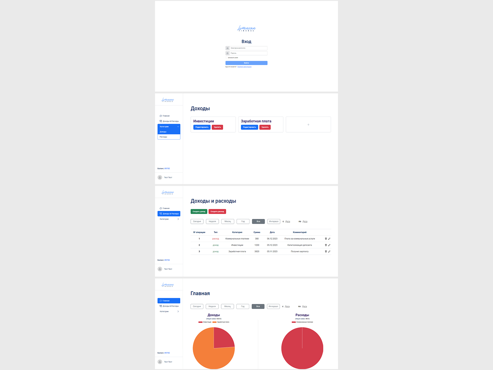

# Веб-приложение для учета финансов

Самостоятельно выполненный проект в рамках обучения на курсе "Профессия Frontend-Разработчик" в онлайн-школе "Айтилогия".

## Внешний вид

## Выполненные задачи:
- Реализация frontend-части SPA в соответствии с техническим заданием и макетом;
- Практика использования чистого JavaScript для реализации SPA (использование компонентов, сервисов, роутинг, запросы, шаблоны);
- Реализация валидации в формах;
- Практика применения ООП-подхода для создания SPA;
- Практика использования Webpack для сборки проекта, копирования нужных файлов, запуска dev-сервера;
- Практика использования спецификации для API в формате .yaml с сервисом editor.swagger.io;
- Практика использования Postman для работы с запросами на backend.

## Используемые технологии:
* HTML
* CSS (SCSS) + Bootstrap
* JavaScript
* Gulp
* WebPack
* JWT-Авторизация
* Postman
* Используется заранее подготовленный backend на node.js